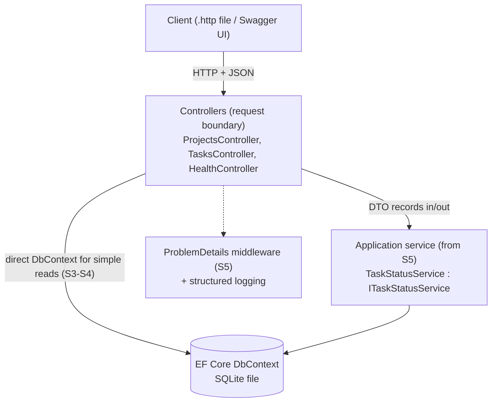

# Plan v2 - Roster-Grounded Delivery Plan

**Status:** Proposed revision of `plan.md`, written after per-trainee analysis of `Trainees info/Trainees_interview_analysis.md`.
**Relationship to plan.md:** plan.md remains the base (session format, syllabus, AI curriculum, rubric are unchanged unless stated here). Plan v2 corrects the cohort model against the *actual roster*, defines per-track scope of the same project, fixes the API contract as a single source of truth, and records the key decisions as ADRs so they stop being re-litigated.

---

## 1. Evaluation: What the Data Changes

### 1.1 What plan.md got right (validated, keep)

- Outcome over coverage; the graduation floor of 11 capabilities.

- Project/TaskItem scope cap; controllers; SQLite default; no premature patterns; auth via starter; testing in Session 6; AI verification every session. *(All confirmed — see ADRs in §7.)*
- Session rhythm with mandatory artifact per session.

### 1.2 What the roster actually says (and plan.md gets slightly wrong)

plan.md claims "3 advanced, 6 intermediate, 6 basic, 5 beginners." The interview file supports a **different and riskier** shape:

- **Only one trainee is a working backend developer** (Yousef Emad — professional Express.js). Nobody else has shipped production backend code. Calling three trainees "advanced" overstates the top of the cohort.
- **The bottom is wider than planned**: at least 6 trainees have *zero* .NET (Mazen, Salama, Rawan, Nour Eldien, Hana, and effectively Mohamed Mossad — no data), and Hazem has CS fundamentals but no .NET.
- **The middle is broad and shallow**: many "has .NET experience" entries mean coursework or a one-month program, not independent building ability.
- **Three trainees have unknown/thin data** (Mohamed Mossad, Hana Haitham, Mohamed Galal) — the baseline diagnostic is not a formality for them; it is the *only* signal.

**Consequences:**

1. The stretch track should be planned around **2-4 people maximum**, not a stable trio. Design stretch work that one person can do alone (Yousef must not be blocked waiting for peers).
2. The foundation track will hold **6-8 people** — roughly a third of the cohort. Foundation support (starter branches, hints, office hours) is not a side channel; it is a first-class deliverable per session.
3. Differentiation must be built into the *project itself* (one codebase, three depths — §5), not improvised per session.

### 1.3 Project evaluation (Task Tracker, Project + TaskItem)

The project is correctly sized and survives contact with this roster **if** every track works on the *same contract*. Two gaps to close:

- The API contract exists only as an endpoint list; status codes, error shape, and pagination envelope are unspecified. Beginners then invent shapes and reviews become style debates. **Fix: §6 freezes the contract.**
- "Per-track expectations" are described but never pinned to sessions. **Fix: §5 matrix.**

---

## 2. Provisional Track Assignment (before baseline diagnostic)

Assignments below are hypotheses from interviews. The 45-minute baseline diagnostic before Session 1 confirms or moves people — **demonstrated ability beats self-report**, and movement between tracks stays open all internship (both directions, announced as normal, not as promotion/demotion).

| Track | Trainees (provisional) | Rationale |
|---|---|---|
| **Stretch** (2-4) | Yousef Emad; candidates: Moaz Alaa, Habiba Khaled, Mohamed Mohamed | Yousef: working backend dev (Express) — concepts exist, needs .NET mapping. Others: real EF Core/CRUD exposure; diagnostic decides |
| **Core** (8-10) | Fatma Alzahraa, Hassan Mohamed, Moaz Ali, Shrouk Ragab, + whichever stretch candidates don't confirm; Abdulwahab, Ahmed Al-said, Nada, Aef, Mohamed Galal pending diagnostic | Practical exposure exists; independence unproven |
| **Foundation** (6-8) | Mazen, Salama Nasser, Rawan Khaled, Nour Eldien, Hana Haitham, Mohamed Mossad, Hazem Mohamed | Zero .NET. Hazem has OOP/DSA — likely the fastest riser; watch him |

**Diagnostic priority list** (thin interview data — read their submissions first): Mohamed Mossad, Hana Haitham, Mohamed Galal, Aef.

**The Yousef protocol** (prevent your one senior from disengaging or dominating):

- Session 1 special assignment: build an **Express ↔ ASP.NET Core mapping sheet** (routing, middleware, DI, config) as he follows along; it becomes a cohort resource and he learns .NET through contrast — the fastest path for a polyglot.
- From Session 2: designated PR reviewer (with your review checklist — he reviews *against the contract*, not against taste).
- Stretch backlog available from day 1 (§5), solo-executable.
- He is a **reviewer, not a co-instructor**: cap his help at "point at the line, ask a question" — never types on someone else's machine. Same rule for all stretch trainees, stated publicly.

**Pairing rules (from the roster):**

- Foundation pairs with Core, never Foundation with Foundation (two blocked beginners drown quietly in a breakout room).
- Do **not** distribute stretch trainees as permanent tutors — rotate every session so beginners build independence (plan.md rule, kept).
- Frontend-background trainees (Mohamed Mohamed, Habiba, Nada) pair well with pure beginners early — they explain HTTP from the consumer side naturally.

---

## 3. Goal, Restated Per Track (the honest version of "highly qualified")

24 hours cannot make 20 highly qualified backend engineers. It can make every level *provably better* and give each a validated next step. Success per track:

| Track | Graduates when they can... | Certificate ceiling |
|---|---|---|
| Foundation | Independently build + explain **one** database-backed endpoint end-to-end (validation, status codes, DTO, async EF query, one test) | Completed |
| Core | Deliver the **full required API** (§6) with tests, Git history, README; defend design choices | Completed / Distinction |
| Stretch | Core + one production concern (auth+ownership, CI, concurrency, or richer querying) + meaningful peer reviews | Distinction |

Every track exits with the **same artifact type** (a working repo + a demo + an explanation interview) — differing in depth, not in kind. That keeps the demo day and the rubric uniform.

---

## 4. Architecture of the Teaching Project

One solution, one visible shape all 8 sessions. Complexity accretes *inside* this shape; no new layers appear without a stated reason (Session 5 adds the service layer *when the first business rule creates the reason*).



Explicitly **not** in this architecture (unchanged from plan.md, now recorded in ADR-004): generic repository, Unit of Work wrapper, AutoMapper, MediatR, CQRS, microservices. Stretch trainees may *compare* against these, in writing, after the core works.

---

## 5. One Codebase, Three Depths — Per-Session Deliverable Matrix

The differentiation mechanism: same session, same repo, different **definition of done**. Foundation "done" is always a strict subset of Core "done" — nobody maintains a different project.

| S | Foundation done = | Core done = (includes Foundation) | Stretch done = (includes Core) |
|---|---|---|---|
| 1 | Health + `GET /api/projects` running from starter; breakpoint hit; written request trace | Same, built from scratch on own machine; `.http` file | + query-string name filter; Yousef: mapping sheet v1 |
| 2 | POST + GET by id with correct 201/404 (starter scaffold allowed) | Full Project CRUD, validation errors, `CreatedAtAction`, PR opened | + 409 duplicate-name with written justification; first peer review given |
| 3 | Projects persist (guided migration); can read the migration aloud | Migration reviewed-then-applied; all Project CRUD on SQLite; explains 2 things the ORM hid | + unique index on Name, constraint-violation mapped to 409 |
| 4 | Tasks list for a project via provided projection example | TaskItem + relationship + nested endpoints + status filter + pagination envelope (§6) | + allow-list sorting; N+1 demonstration with query log |
| 5 | Status-transition rule works (pair-built); can name which class owns the rule | Rule in `ITaskStatusService`; ProblemDetails everywhere; one refactor PR with reasoning | + written repository-vs-DbContext comparison **or** domain-exception design |
| 6 | One unit test on the rule, run green locally | + 2 integration tests (one negative) via `WebApplicationFactory`; seeded bug fixed test-first | + GitHub Actions build/test workflow on their repo |
| 7 | Threat-model worksheet: finds and fixes 2 real issues (secret in config, over-posting, log leak) | Auth starter integrated; one ownership rule enforced and integration-tested | + auth implemented independently **or** policy-based authorization |
| 8 | Release checklist on the single-endpoint slice; 4-min demo | Full checklist; OpenAPI metadata; reproducible README (tested by a stranger) | + deployment or CI badge; demo includes one tradeoff defense |

**Recovery rule** (from MILESTONES.md, now per-track): a Foundation trainee behind after S4 stops chasing the full API and works *only* the graduation-floor slice (one endpoint, deep) on the recovery branch. That is a planned path, not a failure path — say so out loud in Session 1.

---

## 6. The API Contract (single source of truth — freeze at Session 2)

All tracks code against this table. Reviews cite it. Trainees' first exposure to "a contract is an agreement, not a suggestion."

### 6.1 Endpoints

| Operation | Method + Path | Success | Failures |
|---|---|---|---|
| List projects | `GET /api/projects?page=1&pageSize=10` | `200` paged envelope | `400` bad paging |
| Get project | `GET /api/projects/{id}` | `200` | `404` |
| Create project | `POST /api/projects` | `201` + `Location` | `400` validation, `409` duplicate name (stretch) |
| Replace project | `PUT /api/projects/{id}` | `204` | `400`, `404` |
| Delete project | `DELETE /api/projects/{id}` | `204` | `404` |
| List tasks in project | `GET /api/projects/{projectId}/tasks?status=Todo&page=1&pageSize=10` | `200` paged envelope | `404` project |
| Create task | `POST /api/projects/{projectId}/tasks` | `201` + `Location` | `400`, `404` project |
| Change task status | `PATCH /api/tasks/{id}/status` | `200` updated task | `400` invalid transition, `404` |

Conventions: **camelCase JSON**; UTC ISO-8601 timestamps with `Utc` suffix in property names (`createdAtUtc`); ids are `int` (teaching simplicity — GUIDs discussed in S3 as a tradeoff, not adopted); no API versioning in v1 (one client, one course — versioning is a S8 *discussion*, not machinery; recorded as deliberate).

### 6.2 Pagination envelope (offset — deliberately, see ADR-005)

```json
{
  "items": [ { "id": 1, "name": "Website Redesign", "description": null, "createdAtUtc": "2026-07-26T10:00:00Z" } ],
  "page": 1,
  "pageSize": 10,
  "totalCount": 42
}
```

`pageSize` max 50, default 10; out-of-range → `400` Problem Details.

### 6.3 Errors: RFC 7807 Problem Details, always

ASP.NET Core emits this natively — teach the shape, not a custom one:

```json
{
  "type": "https://tools.ietf.org/html/rfc9110#section-15.5.1",
  "title": "One or more validation errors occurred.",
  "status": 400,
  "errors": { "name": ["The Name field is required."] },
  "traceId": "00-..."
}
```

Rule for all tracks: **no naked `500`s by Session 5** — every failure path lands in one of the table's codes or the S5 exception middleware.

### 6.4 DTO rule (all tracks, from Session 1)

Request and response types are `record`s; EF entities never cross the controller boundary. This is the cheapest architectural habit in the course and the highest-value one.

---

## 7. Architecture Decision Records (ADR-lite)

Recorded so future planning (including Claude Desktop sessions) inherits decisions instead of reopening them.

**ADR-001: Controllers, not Minimal APIs.** *Accepted.* Visible request boundary for beginners, one structure for 8 sessions (no mid-course switch), enterprise familiarity, and S5's thin-controller lesson requires a controller to thin. Cost: 3 faith-based concepts in S1 (`[ApiController]`, `ControllerBase`, attributes) — repaid in S2 per the concept-debt ledger. Alternative (minimal APIs) reserved as stretch comparison.

**ADR-002: SQLite default; SQL Server only if Netpoints mandates and pre-verifies.** *Accepted.* Zero-install, file-visible database protects live session time; EF Core makes the switch a provider swap later. Cost: some SQL Server-specific behavior (concurrency, types) untaught — acceptable at this level.

**ADR-003: .NET 10 LTS.** *Accepted.* Active LTS through Nov 2028 for a 2026 cohort; .NET 8 leaves support Nov 2026. If the company standardizes on 8, teach identical concepts on 8 — never mix SDKs in one cohort.

**ADR-004: Direct DbContext + one focused service; no repository/UoW/AutoMapper/MediatR.** *Accepted.* EF Core already implements repository/UoW; wrappers at this level are pass-through cargo cult and hide `IQueryable`. Explicit `Select` projection teaches the mapping AutoMapper would hide. Patterns return as *written comparisons* for stretch. Cost: stretch trainees see less "enterprise ceremony" — mitigated by the S5 comparison exercise.

**ADR-005: Offset pagination, not cursor.** *Accepted.* `Skip/Take` + `totalCount` is understandable in one diagram and sufficient at teaching scale; cursor pagination requires ordering-key intuition the cohort doesn't have yet. Consequence: we *tell* stretch trainees where offset breaks (deep pages, concurrent inserts) — awareness without implementation.

**ADR-006: Auth ships as a sanitized starter; implementation is stretch-only.** *Accepted.* Identity+JWT from scratch consumes 2+ sessions and blocks the graduation floor. Security *concepts* (authn vs authz, ownership, secrets, OWASP-for-APIs) remain mandatory for all in S7. Cost: core trainees use tokens they didn't mint — acceptable; ownership enforcement is the transferable skill.

---

## 8. Assessment Deltas (rubric unchanged; evidence tightened)

The plan.md rubric and 70/100 floor stand. Three additions driven by the roster:

1. **Baseline diagnostic doubles as track placement**: 45 min — 15 min C# reading comprehension (predict output), 15 min tiny fix task in a prepared repo, 15 min written "trace this request" question. Grade only into Foundation/Core/Stretch hypotheses.
2. **Explanation interviews are scheduled by track**: Foundation first (they need the earliest feedback and possibly a second attempt), stretch last.
3. **Peer review counts as stretch evidence**: two substantive contract-cited reviews ≥ one stretch feature. This makes the Yousef protocol gradeable.

---

## 9. Updated Risk Register (roster-specific additions)

| Risk (new/raised) | Signal | Mitigation |
|---|---|---|
| Foundation track is 35-40% of cohort, larger than planned | Diagnostic results | Starter branches per session are prepared *before* S1, not on demand; office hours capacity doubled for weeks 1-2 |
| Single advanced trainee disengages | Yousef silent in S1-S2 | Yousef protocol (§2) active from S1; check in personally after S2 |
| Unknown-level trainees mis-tracked | Thin interview data (Mossad, Hana, Galal, Aef) | Their diagnostics read first; track move in S2 is cheap, in S5 expensive |
| "Course-experienced" middle overestimates itself | S2 checkpoint quality | Checkpoint #1 gates track *confirmation*; self-reported skill never overrides artifact evidence |
| Odoo/Express habits collide with C# idioms | Fatma (Python), Yousef (JS) | Frame differences as mapping, not correction; both get the mapping-sheet exercise pattern |

Existing plan.md risks (environment, pre-work skipped, copying, scope creep, demo overrun) remain in force.

---

## 10. Actions Before Session 1 (delta to the existing prep list)

1. Build and send the **baseline diagnostic** (§8.1) — the track table in §2 is unusable until it returns.
2. Prepare **per-session Foundation starter branches** through S4 now (the wide bottom makes them load-bearing).
3. Freeze §6 as `api-contract.md` in the instructor repo; the S2 pre-work pack references it.
4. Brief Yousef privately on the reviewer role before S1 (people accept roles better when asked, not assigned publicly).
5. Confirm with Netpoints: trainee count (20 listed vs "about 22"), .NET 10 acceptance, AI tool policy — unchanged open items from plan.md §13.

---

## 11. Success Definition (unchanged, now with names attached)

The internship succeeds when **Rawan, Mazen, or Salama** — zero .NET on day 0 — independently implements and explains one database-backed endpoint with validation, correct HTTP behavior, DTO mapping, an async EF query, and a test... **and** when **Yousef** leaves having mapped a professional skillset onto .NET with one production-grade feature and a review trail to show for it. If both ends of the roster get that, everyone in between is covered.
